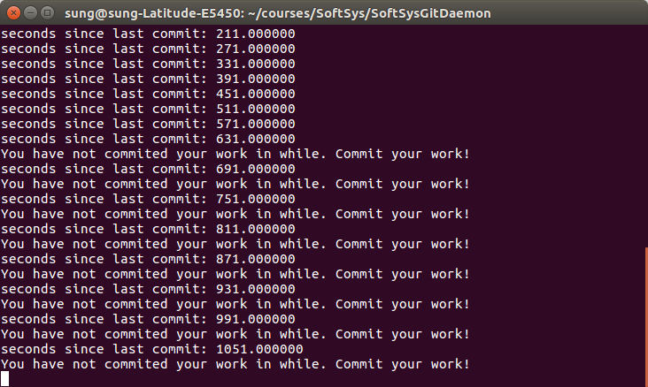

# SoftSysGitDaemon
Spring 2018 Software Systems Project 1

Git Daemon program in action

To run the program:
- download `no_daemon.c` to your working directory with git initialized
- Run `gcc no_daemon.c -o no_daemon`
- Run `./no_daemon`
- Leave the terminal window open as it will display alert messages

The link to a project report: [link](https://github.com/SungwooPark/SoftSysGitDaemon/blob/master/reports/report.md)
