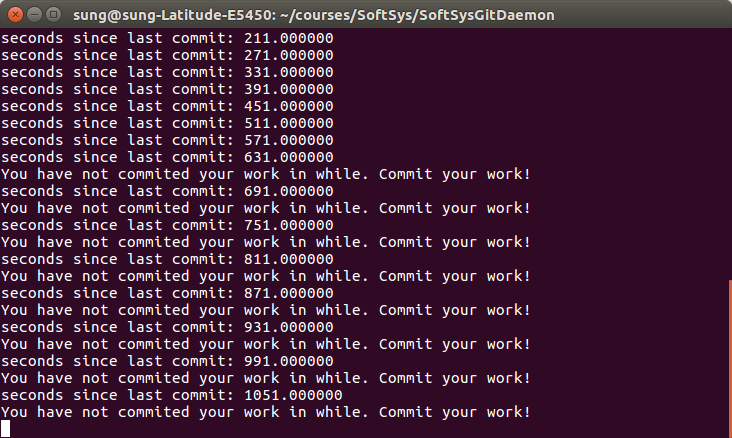

# Project Report - Git Daemon

## By Sungwoo Park, Olin College of Engineering '19

### Introduction

This report is a collection of thoughts, ideas, and processes related to this project that I deemed important and useful for future students in Software Systems who might want to work on a project in a related area. This document also serves as a brief overview of the program that I worked on a part of this project, for the general audience who might be interested in seeing my work.

### Project objective

The main objective of this project was to create a 'deamon' (the reason why word 'daemon' is in quotation will be presented later) that can monitor my git activity. It would provide a simple but useful functionality of alerting me when certain amount of time has passed since my last commit. The goal of this project was twofold: 1) to create an useful tool that I can actually use in future and 2) to familiarize myself with programming in C by working on a manageable project with good balance of challenges and achievable goals.

### Reflection on the goals and progress

I have achieved the first goal of creating an useful tool, even though the level of complexity and breadth of functionality of the program is quite lower than what I anticipated in the beginning of the project. The subject of writing a daemon program was something that was completely unfamiliar to me so I spent a lot of time before start writing my code researching and experimenting with different code snippets. This preparation period took way longer than I expected so I spent less time that what I think should've spent in actual coding part of the project, thus having more meager final project.

Also, I had to take a slight pivot later in the project phase because I had a misunderstanding of what daemon is. By definition, UNIX daemon do not have a controlling terminal, which means that its outputs will usually be logged to a file. This was not the design that I was thinking about. I was thinking a terminal output screen that occasionally displays useful alert message. I made a sort of last-minute big design decision to write a program that acts like a daemon in a sense that it will be running on the background while the user is coding, but it will be running on the terminal. Therefore, my program ended up being not actually typical UNIX daemon, but rather 'daemon'-like tool.

In terms of learning goals, I would say I have learned a quite lot about programming in C, even though the focus of the learning turned out to be little different from what I expected. In the beginning, I thought I would get a lot of practice in C programming because I thought I would be spending most of my time coding. However, what actually happened was that I learned a lot about how UNIX daemons work and more low-level system level programming related to things like daemons, processes, and threads. I don't think this was time wasted because I believe this knowledge that I gained is just as useful as familarity with C programming language. I also got a fair bit of practice researching and learning about topic in which there is not much resources online and most of available materials online are very technical.

### Retrospective and honest assessment

I will discuss few things that I think I should've done better and differently.

First of all, I think I should have started coding earlier. In retrospect, even though my time spent on research and learning was useful in that I learned a lot of new stuff, the cost of it was less impressive final product. Related to this matter was the issue of accountability and deadline. I think the part of reason why I failed to appropriate adequate amount of time in each component of the project (research and implementation) was because I was working alone. Since I did not have a partner that was moving along with me, I just did what I felt like I need to do at the time, without really thinking ahead. There also wasn't really a deadline for each task that I followed, resulting in not getting work done as quickly and efficiently as it should be. More conscious strategization of my project work plan would have been helpful in this regard, using tools like Trello. Again, since I was working alone I did not really utilize Trello as its fullest extent. I will use this project as a lesson that taught me that accountability and deadline are important to get work done. The advice for my future self and future Software Systems student would be really put effort into creating a system of accountability and deadline of tasks, through whatever means necessary (Trello seems to work fine). Or at least, work with other people to keep you in track.

If I were to work more on this project, few possible next steps would be:
- Monitor the number of lines of code written since last commit in addition to the time elapsed.
- Make the alert threshold for the amount of time or number of lines of code since last commit user configurable.

### Git Daemon program in action



Above image is a terminal output of the git "daemon" program in action. The user starts this program before he starts coding and leaves the terminal window open. Occasionally, the program displays an alert message to the user, one of which is telling user to commit the work since long time has passed since the last commit.

### Implementation

The decision to move away from conventionally daemon design to my own modified design really simplified the program. There are two main components of the program: 1) Getting time since last commit and 2) periodically checking this time.

To get a time since last commit, I just used a shell command to get the log of previous commits and parsed the output to get the timestamp of the last commit.
```
fp = popen("git log", "r"); //Run shell command
...
while (fgets(output, sizeof(output)-1, fp) != NULL) {
  //Parse the output
  ...
```

After getting the time elapsed since the last commit, I periodically check this value. I implemented the periodic checking by putting `sleep()` command within an infinite loop.
```
while(1){
  double last_commit_time_diff = time_since_last_commit();
  printf("seconds since last commit: %f\n", last_commit_time_diff);
  if (last_commit_time_diff > 600.0){
    printf("You have not commited your work in while. Commit your work!\n");
  }
  sleep(60);
}
```

There are definitely more elegant way to do this that allows more flexibility and functionality, but this was the implementation that I settled given the limited time and ease of implementation and understanding.

### Resources

Even though I eventually moved away from conventional daemon design, I will list a resources that I consulted regarding UNIX daemon implementation for the sake of documentation and for those who might be interested in pursuing this route.

- [Stack overflow article giving brief introduction to writing a daemon in Linux](https://stackoverflow.com/questions/17954432/creating-a-daemon-in-linux)
- [Git repository of simple example daemon written for Linux](https://github.com/jirihnidek/daemon)
- [Linux man page for daemon with in depth descriptions](https://www.freedesktop.org/software/systemd/man/daemon.html)
- [A simple bash script daemon that served as an inspiration for my modified design](https://github.com/kolbasa/git-repo-watcher)
- [A bash script that watches git repository](https://github.com/kolbasa/git-repo-watcher)

Following is a link to source code on github: [source code](https://github.com/SungwooPark/SoftSysGitDaemon/blob/master/no_daemon.c)
